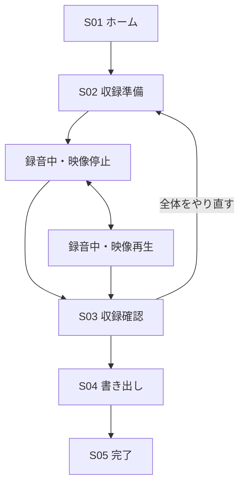

# さといも 実装用要件定義・基本設計書

- 文書版: 1.1
- ステータス: 初版実装用・確定
- 作成日: 2026-08-10
- 対象: 実装担当LLMおよび開発者
- 対応OS: Windows 10/11 x64、macOS Apple Silicon
- 想定入力: 1080p・60fps、30分以内
- 標準出力: 1920×1080・30fps・MP4

## 製品名・内部識別子

- 正式な製品表示名: `さといも`
- 表記規則: UI、インストーラー、README、要件書では、ひらがなの「さといも」と表記する。カタカナ、漢字、ローマ字を表示名として使用しない。
- 内部slug、実行ファイル名、package名: `satoimo`
- Tauri `productName`: `さといも`
- プロジェクトディレクトリ拡張子: `.satoimo`
- OS既定保存フォルダ名: `さといも`

---

## 0. 実装担当LLMへの指示

この文書だけを入力として、動作する初版を実装すること。本書で「MUST」とした機能、状態、例外処理、テストを省略してはならない。

### 0.1 実装時の原則

1. 本書にない大型機能を追加しない。
2. YouTube連携、クラウド、複数動画編集、部分録り直しは実装しない。
3. デモ用の見た目だけで完了とせず、実ファイルの再生、実マイク録音、イベント保存、FFmpeg書き出しまで接続する。
4. `TODO`、空のイベントハンドラー、成功固定のモックを残さない。
5. OS固有処理は抽象化し、WindowsとmacOSで同じUIコードを使用する。
6. 依存関係は実装時点の安定版を使用し、lockfileへ固定する。Tauriは2.x系を使用する。
7. FFmpeg、ffprobe、使用ライブラリのライセンスを `THIRD_PARTY_NOTICES.md` に記載する。
8. 受入試験を実行できない環境では、該当試験を自動化スクリプトとして用意し、未実行理由を明記する。
9. ユーザーの動画や音声をリポジトリ、テスト結果、ログへ含めない。

### 0.2 納品物

- 完全なソースコード
- Windows 10/11 x64用ビルド設定
- Apple Silicon macOS用ビルド設定
- README（開発、テスト、ビルド、配布、トラブル対応）
- 自動テスト
- テスト用にプログラム生成できる短い動画・音声fixture
- `THIRD_PARTY_NOTICES.md`
- 本書と実装の対応表 `docs/requirements-traceability.md`
- 既知の制約 `docs/known-limitations.md`

署名証明書は納品対象外である。初版は手動配布を前提とし、署名情報を外部から設定できるビルド構成にする。

---

## 1. 製品概要

さといもは、スポーツチームの練習動画を見ながら熟練メンバーが後付け実況を行うためのローカルデスクトップアプリである。

実況者は、映像を再生・停止・巻き戻し・早送り・速度変更し、一時停止中の映像へフリーハンド線を描く。アプリは次の情報を別々に記録し、収録終了後に完成動画を再構成する。

- ローカルの元動画
- マイク実況音声
- 再生操作ログ
- フリーハンド描画ログ

完成動画には、収録中の再生操作、一時停止時間、巻き戻し、速度変更、描画をそのまま反映する。アプリのUI、通常のマウスカーソル、通知、他ウィンドウは映さない。

## 2. 解決する課題

- YouTube画面上では短い巻き戻しやコマ単位の確認がしにくい。
- 再生速度変更のために解説の流れが止まる。
- 注目箇所を映像上で明示できない。
- 画面収録ではUIや通知が映り、リアルタイムエンコード負荷も発生する。
- WindowsとmacOSで録画手順が異なる。

## 3. 確定済みプロダクト判断

| 項目 | 確定内容 |
| --- | --- |
| 入力 | 撮影時のローカル動画を使用する。YouTube URLは扱わない。 |
| 入力基準 | 1080p、60fps、30分以内。 |
| 完成動画 | 実況中の停止、巻き戻し、速度変更、重複再生をそのまま再現する。 |
| 収録の修正 | 部分編集はしない。問題があれば収録全体をやり直す。 |
| 収録開始 | 現在の元動画位置から録音を開始し、映像は停止したままにする。カウントダウンしない。 |
| 描画 | フリーハンド線のみ。ペンボタン選択後、一時停止中のみ描ける。 |
| 線の寿命 | 再生開始または手動消去まで残る。速度変更、シークでは自動消去しない。 |
| 元動画音声 | 小さく残し、実況音声とミックスする。 |
| 標準音量 | 実況100%、元動画20%。収録前に変更可能。 |
| 出力 | 1920×1080、30fps、H.264/AACのMP4。 |
| 収録後 | プレビューまたは書き出しのみ。トリミングしない。 |
| 右パネル | 手動で折り畳める。収録開始時には自動で閉じない。 |
| 収録終了 | 終了ボタンを1秒間長押しする。通常クリックでは終了しない。 |
| 対応OS | Windows 10 x64、Windows 11 x64、Apple Silicon macOS。 |
| メモリ | 8GBを最低対象とする。 |
| 配布 | インストーラーまたはアプリファイルを手動共有する。自動更新なし。 |

---

## 4. スコープ

### 4.1 初版に含める

- ローカル動画の選択、解析、再リンク
- 必要時のCFRプロキシ生成
- 再生、一時停止、シーク、コマ送り、速度変更
- マイク選択、レベル表示、録音
- フリーハンド描画、1つ戻す、全消去
- 操作イベントの追記保存
- 自動保存、クラッシュ復旧
- 完成動画プレビュー
- 1080p30 MP4書き出し
- Windows/macOS向け手動配布物

### 4.2 初版に含めない

- YouTubeのURL再生、ダウンロード、認証、アップロード
- クラウド保存、アカウント、共同編集
- 実況の一時停止・再開、区間録り直し、途中削除、トリミング
- 複数テイクを選ぶUI
- 複数動画、複数カメラ、BGM、テロップ、トランジション
- レーザーポインター、矢印、円、矩形
- 自動文字起こし、AI追跡、ハイライト生成
- Windows ARM、Intel Mac、Linux、スマートフォン
- 自動更新

---

## 5. 技術構成

### 5.1 固定する構成

| 層 | 採用技術・責務 |
| --- | --- |
| デスクトップ基盤 | Tauri 2.x |
| UI | React、TypeScript、Vite。外部UIフレームワークは使わずCSSで構築する。 |
| ネイティブコア | Rust stable |
| 動画表示 | OS WebView内のHTML `video`。選択済み動画だけをRange対応のカスタムプロトコルで配信する。 |
| 描画表示 | 動画要素と同一座標系のHTML Canvas。 |
| 音声収録 | RustのCPAL。音声サンプルを逐次ファイルへ保存する。 |
| メディア解析 | 同梱したffprobe sidecar。 |
| プロキシ・書き出し | 同梱したFFmpeg sidecar。 |
| データ | JSON、追記型JSON Lines、PCM WAV。DBは使用しない。 |
| テスト | Rust unit/integration、Vitest、React Testing Library、PlaywrightまたはTauri対応E2E手段。 |

### 5.2 プロセス境界

- WebView: 画面、キーボード、動画操作、Canvas描画、表示状態。
- Rustコア: プロジェクト、セッション時計、イベント採番、音声収録、ファイルI/O、プロセス管理。
- FFmpeg/ffprobe: 独立sidecar。プロキシまたは書き出し中に異常終了してもプロジェクトを壊さない。
- UIスレッドでメディア変換やファイル全体の読み込みを行わない。

### 5.3 ローカル動画の配信

任意のファイルパスをWebViewへ直接公開してはならない。Rust側で次を実装する。

1. ユーザーが選択した元動画またはプロキシのcanonical pathを許可リストへ登録する。
2. ランダムなmedia tokenを発行する。
3. WebViewへ実ファイルパスではなく `media://localhost/{token}` 相当のURLを渡す。
4. `GET` と `HEAD`、単一Rangeリクエストを処理する。
5. Range時は `206 Partial Content`、`Content-Range`、`Accept-Ranges: bytes`、正しい `Content-Length` を返す。
6. tokenは現在開いているプロジェクトのファイルだけへ解決する。
7. path traversal、未登録token、複数Rangeは拒否する。

Tauri標準asset protocolで動画の安定シークと実行時スコープを満たせる場合は利用してよいが、全ホームディレクトリを許可する設定は禁止する。

---

## 6. 対応環境とメディア

### 6.1 OS

- Windows 10 22H2 x64
- Windows 11 x64
- Apple Silicon Mac上のmacOS 13以降

WindowsではWebView2 Runtimeを使用する。未導入の場合、インストーラーが導入を案内またはbootstrapperを実行する。

### 6.2 ハードウェア

- RAM: 8GB以上
- 画面: 1366×768以上
- 空き容量: 実況開始前および書き出し前に算出して検査
- 内蔵またはOSが認識する外付けマイク

### 6.3 入力

- 基準: 1920×1080、60fps、30分以内
- 直接再生の第一対応: MP4またはMOV、H.264、AAC
- HEVC、可変フレームレート、WebViewで再生できない形式はプロキシ対象
- 音声なし動画も許可する
- 回転メタデータを反映する

### 6.4 プロキシ

次のいずれかに該当したら、自動的にプロキシ作成画面を出す。

- HTML videoでデコードできない
- VFRである
- 長辺が1920pxを超える
- ffprobe解析で60fpsを大きく超える
- 試験再生に失敗する

プロキシ仕様:

- MP4
- H.264
- 1920×1080以内、元アスペクト比を維持してletterbox
- CFR 60fps
- AAC 48kHz
- source timestamp 0をプロキシtimestamp 0へ一致させる
- 元動画と継続時間の差を1フレーム以内にする
- プロジェクトの `proxy/` に保存し、完了前は `.part` を付ける

プロキシ作成中は進捗、キャンセル、必要容量を表示する。キャンセル時は `.part` のみ削除する。

---

## 7. 画面と画面遷移

### 7.1 画面一覧

| ID | 画面 | 目的 |
| --- | --- | --- |
| S01 | ホーム | 新規作成、既存プロジェクト、最近使った項目 |
| S02 | 収録画面 | 準備、元動画操作、録音、描画 |
| S03 | 収録確認画面 | 完成時間軸でプレビュー、やり直し、書き出し |
| S04 | 書き出し進捗 | 進捗、残り時間、キャンセル |
| S05 | 完了 | 出力ファイル再生、Finder/Explorer表示、ホームへ戻る |
| S06 | 復旧 | 異常終了した収録の検査・復旧 |

ファイル選択、保存先選択、確認、エラーはOSダイアログまたはモーダルであり、独立画面にしない。

### 7.2 正常系遷移



### 7.3 収録画面内部状態

| 状態 | 説明 | 許可する主操作 |
| --- | --- | --- |
| PREPARING | 動画は停止、未録音 | 位置決め、再生、シーク、音量、マイク、ペン設定、収録開始 |
| STARTING | マイクstreamと保存先を準備中 | キャンセルのみ |
| RECORDING_PAUSED | 録音中、動画停止 | 解説、再生、シーク、コマ送り、速度変更、描画、線を戻す、全消去、終了長押し |
| RECORDING_PLAYING | 録音中、動画再生 | 解説、停止、秒シーク、速度変更、終了長押し |
| RECORDING_SCRUB | タイムラインをドラッグ中 | シーク確定またはキャンセル |
| STOP_HOLDING | 終了ボタン長押し中 | 長押し継続またはキャンセル |
| FINALIZING | WAVとイベントログを確定中 | 操作不可、進捗表示 |
| REVIEW_PREPARING | プレビュー用タイムラインを構築中 | キャンセル不可、短い進捗表示 |

### 7.4 状態遷移規則

1. PREPARINGで「実況を開始」を押す。
2. マイク、保存先、空き容量を検査する。失敗時はPREPARINGへ戻る。
3. Rust側のSessionClockと録音を開始し、`session_start` を保存する。
4. 映像は現在位置で停止したままRECORDING_PAUSEDへ入る。自動再生しない。
5. Spaceまたは再生ボタンでRECORDING_PLAYINGへ入る。
6. 再生中にSpaceを押すとRECORDING_PAUSEDへ戻る。
7. 再生中の±5秒・±10秒は、再生を継続したまま即時シークする。
8. 停止中の秒シークは停止状態を維持する。
9. タイムラインのドラッグ開始時は必ず映像を停止し、ドラッグ終了後も停止を維持する。
10. コマ送りはRECORDING_PAUSEDだけで許可する。
11. 描画はRECORDING_PAUSEDかつペンモードONのときだけ許可する。
12. 再生開始時はペン入力を無効化するが、ペン選択状態は保持する。次回停止時に再度描ける。
13. 終了ボタンを押している間、0〜1秒の進捗をボタン内に表示する。
14. pointer/keyを1秒未満で離した場合、終了をキャンセルする。
15. 1秒到達時に `session_stop` を保存しFINALIZINGへ入る。
16. FINALIZING成功後、S03へ遷移する。
17. S03の「やり直す」は確認ダイアログを出す。承認後、現在テイクを退避してS02 PREPARINGへ戻す。
18. 新しいテイクが正常終了するまで退避テイクを削除しない。

### 7.5 異常系遷移

- 起動時に未確定 `.part` があればS06へ遷移する。
- マイク切断、書き込み失敗、容量不足は録音を即時停止し、復旧可能な状態でS06へ遷移する。
- OSスリープ検知時は録音を停止し、無断で再開しない。
- FFmpeg失敗時はS03へ戻し、入力・イベント・音声を保持する。

---

## 8. 画面レイアウト仕様

### 8.1 共通

- アプリ最小ウィンドウ: 1100×700 CSS px
- 1366×768で縦横スクロールなし
- 初回起動: 1280×760。前回の位置とサイズを保存する。
- ウィンドウが小さい場合、動画を優先して縮小する。ボタン文字を省略しない。
- UI言語は日本語固定。初版に言語切替なし。
- ダーク・ライトはOS設定へ追従する。

### 8.2 S01 ホーム

上から次の順に配置する。

1. アプリ名と設定ボタン
2. 主ボタン「新しい実況を作成」
3. 副ボタン「プロジェクトを開く」
4. 最近使ったプロジェクト最大8件

新規作成では先に動画を選び、その後プロジェクト保存先を選ぶ。既定保存先はOSのDocuments配下 `さといも`。プロジェクト名は元動画basenameを初期値とする。

### 8.3 S02 収録画面

#### 上部バー: 高さ56px

- 左: ホームへ戻る、プロジェクト名、自動保存状態
- 中央: 状態ラベル、収録経過時間
- 右: 右パネル開閉、収録開始または「1秒長押しで終了」

録音中の状態は色だけでなく「録音中・映像停止」「録音中・映像再生」の文字で示す。

#### 中央ワークスペース

- 展開時: `動画領域 = 残り幅 - 280px`、右パネル280px
- 折り畳み時: 右側に54pxのツールレールだけ残す
- 動画は16:9を維持し、利用可能領域内へcontain表示する
- letterbox部分は描画対象にしない
- Canvasは映像の実表示矩形と完全一致させる

#### 動画領域

- 動画本体
- Canvas描画層
- 停止中表示
- 描画可能時の短い表示
- 読み込み中スピナー

通常のマウスカーソルはプレビューUIでは見えるが、完成動画には含めない。

#### 下部: 110px以内

1. 元動画時刻 `HH:MM:SS.ff` と総時間
2. 元動画タイムライン
3. 再生操作: −10秒、−5秒、再生/停止、＋5秒、＋10秒
4. 速度: 0.25、0.5、0.75、1.0、1.25、1.5、2.0
5. 停止中のみ前後1フレーム

#### 右パネル展開時

PREPARING:

- マイク選択
- 入力レベル
- 実況音量0〜100%、既定100%
- 元動画音量0〜100%、既定20%
- ヘッドホン推奨表示
- ペン色、太さ

録音中:

- マイク名と入力レベルは表示のみ
- 音量sliderは無効化する
- ペンボタン、色、太さ、1つ戻す、すべて消す

右パネルを閉じた54pxレール:

- パネルを開く
- ペンON/OFF
- 1つ戻す
- すべて消す
- マイク正常/異常アイコン

### 8.4 S03 収録確認

- S02と同じ動画中心レイアウトを再利用する。
- タイムラインは元動画時刻ではなく完成動画時刻を示す。
- 描画編集、音量変更、トリミングは禁止する。
- 主操作は「書き出す」。副操作は「収録全体をやり直す」。
- やり直しには「現在の収録は新しい収録が完了するまで保持されます」と表示する。
- プレビューはイベントログを解釈した仮想タイムラインを再生する。先に完成MP4を生成する必要はない。

### 8.5 S04/S05

- 書き出し時はOS保存ダイアログを表示する。
- 既定ファイル名: `{元動画basename}_commentary_YYYYMMDD-HHmm.mp4`
- 同名ファイルがある場合はOS標準の上書き確認を使用する。
- 進捗画面にはpercent、経過時間、推定残り時間、保存先、キャンセルを表示する。
- 完了画面には「Finder/Explorerで表示」「ホームへ戻る」を表示する。完成動画のアプリ内再生は行わない。

---

## 9. 操作仕様

### 9.1 ショートカット

| 操作 | Windows / macOS |
| --- | --- |
| 再生・停止 | Space |
| 1/30秒戻る・進む | ← / → |
| 1秒戻る・進む | Shift + ← / → |
| 10秒戻る・進む | Ctrl/Command + ← / → |
| 前後1フレーム | , / . |
| 速度を1段階下げる・上げる | [ / ] |
| 1.0倍へ戻す | \ |
| 1つ戻す | Ctrl/Command + Z |
| 線をすべて消す | C |

- 収録開始と終了にグローバルショートカットを設けない。
- select、slider、ダイアログへフォーカス中は再生ショートカットを無効化する。
- ショートカット変更機能は初版に含めない。
- ← / → の長押しは1/15秒間隔で1/30秒ずつ移動し、2秒保持で動画上の約1秒分を移動する。

### 9.2 描画

- ペンボタンを押してペンモードをONにする。
- 停止中かつ動画実表示矩形内でprimary pointerをdragしたときだけ描く。
- マウス、トラックパッド、Pointer Eventsを使用する。タッチ・ペン専用最適化は不要。
- 既定色: `#FF3B30`
- 色候補: 赤、黄、シアン、白。任意色pickerも使用可能。
- 太さ: 細4px、中8px、太12px（1080p出力時）。既定は中。
- 太さは動画高さに対する比率で保存し、表示解像度に追従する。
- 描画点は映像実表示矩形に対する0〜1の正規化座標で保存する。
- letterbox上では描画開始しない。dragが外へ出た点は0〜1へclampする。
- `1つ戻す` は現在表示中の最後のstrokeをその時点から非表示にする。
- `すべて消す` は現在表示中の全strokeをその時点から非表示にする。
- redo、消しゴム、個別選択はない。
- 再生開始時は表示中のstrokeをすべて非表示にする。シーク、速度変更ではstrokeを消さない。
- 完成動画では線を描いていく過程もsession時刻に沿って表示する。

### 9.3 終了長押し

- `pointerdown` またはボタンfocus中のSpace/Enter keydownで計時開始。
- 1,000ms連続保持で終了を確定する。
- `pointerup`、`pointercancel`、`pointerleave`、keyup、window blurでキャンセルする。
- 0〜1,000msをボタン内のprogressとして表示する。
- 1,000ms到達後は一度だけ終了処理を起動する。

---

## 10. プロジェクトとファイル

### 10.1 ディレクトリ

```text
project-name.satoimo/
  project.json
  project.json.bak
  project.lock
  events/
    take-current.jsonl
    take-current.jsonl.part
  audio/
    take-current.wav
    take-current.wav.part
  proxy/
    source-proxy.mp4
    source-proxy.mp4.part
  cache/
    preview-index.json
    render-filter.txt
    annotations.ass
  recovery/
  exports/
```

元動画はプロジェクトへコピーしない。絶対パスと可能な場合の相対パスを保持する。

### 10.2 project.json

```json
{
  "schemaVersion": 1,
  "appVersion": "0.1.0",
  "projectId": "uuid",
  "name": "8月10日 練習動画",
  "createdAt": "2026-08-10T06:00:00Z",
  "updatedAt": "2026-08-10T06:30:00Z",
  "source": {
    "absolutePath": "...",
    "relativePath": "...",
    "fingerprint": {
      "sizeBytes": 0,
      "modifiedAtMs": 0,
      "headTailSha256": "..."
    },
    "durationUs": 0,
    "width": 1920,
    "height": 1080,
    "fpsNumerator": 60,
    "fpsDenominator": 1,
    "videoCodec": "h264",
    "audioCodec": "aac",
    "hasAudio": true,
    "rotationDegrees": 0
  },
  "proxy": {
    "status": "none",
    "relativePath": null,
    "sourceFingerprint": null
  },
  "mix": {
    "microphoneGain": 1.0,
    "sourceGain": 0.20
  },
  "pen": {
    "color": "#FF3B30",
    "widthNormalized": 0.007407
  },
  "take": null,
  "lastSourcePositionUs": 0,
  "ui": {
    "rightPanelCollapsed": false
  }
}
```

### 10.3 保存規則

- `project.json` はtempへ書いた後、atomic renameする。
- 成功前の旧版を `project.json.bak` として保持する。
- 重要イベント後および5秒ごとに保存する。
- `project.lock` で同一プロジェクトの二重起動を防ぐ。
- lockのPIDが存在しなければstale lockとして復旧確認後に置換できる。
- 元動画fingerprintはファイルサイズ、mtime、先頭1MiBと末尾1MiBのSHA-256で構成する。
- 再リンク時はfingerprint一致を推奨し、不一致の場合は警告してユーザー確認を求める。

---

## 11. 収録イベント仕様

### 11.1 時計

- Rust側でSessionClockを生成し、単調増加時計を基準とする。
- すべての時刻は符号なし整数microsecondsで保存する。
- `sessionUs` はsession_startを0とする。
- wall-clockは表示・ファイル名だけに使い、同期計算に使わない。
- Rust側がイベントへ連番と最終timestampを付与する。
- WebViewが送るsource timeはRustで範囲検証する。

### 11.2 JSON Lines共通形式

```json
{"schemaVersion":1,"seq":1,"sessionUs":0,"type":"session_start","payload":{}}
```

必須フィールド:

- `schemaVersion`: 1
- `seq`: 1から始まる連続整数
- `sessionUs`: 直前イベント以上
- `type`: 下表
- `payload`: type固有object

### 11.3 イベント

| type | payload | 発生条件 |
| --- | --- | --- |
| session_start | `sourceUs`, `rate`, `mix`, `audioFormat` | 録音開始成功時 |
| play | `sourceUs`, `rate` | 映像再生開始 |
| pause | `sourceUs` | 映像停止 |
| seek | `fromSourceUs`, `toSourceUs`, `continuesPlaying`, `method` | 秒移動、timeline、コマ移動 |
| rate_change | `sourceUs`, `fromRate`, `toRate`, `playing` | 速度変更 |
| stroke_begin | `strokeId`, `x`, `y`, `color`, `widthNormalized` | pointerdown |
| stroke_point | `strokeId`, `x`, `y`, `pressure` | drag中 |
| stroke_end | `strokeId`, `x`, `y` | pointerup/cancel |
| stroke_hide | `strokeIds`, `reason` | undoまたはclear |
| session_stop | `sourceUs`, `playing` | 1秒長押し成立 |
| interruption | `reason` | mic、disk、sleep等による停止 |

`method` は `step_1s`、`jump_5s`、`jump_10s`、`frame`、`scrub` のいずれか。

### 11.4 イベント不変条件

- session_startとsession_stop/interruptionは各takeに1つずつ。
- playは停止状態からのみ、pauseは再生状態からのみ発生する。
- stroke系は停止状態でのみ発生する。
- x、y、pressureは0〜1。
- rateは `0.25, 0.5, 0.75, 1.0, 1.25, 1.5, 2.0` のいずれか。
- sourceUsは0〜source.durationUs。
- 破損行は末尾に限り切り捨て可能。途中行破損は復旧失敗として診断を出す。

### 11.5 書き込み

- イベントは1行ごとに追記する。
- 最大1秒または重要イベントごとにflushする。
- 5秒ごとにfsyncする。
- 収録終了時にfsyncし、`.part` から正式名へatomic renameする。

---

## 12. 音声収録

### 12.1 入力

- CPALで入力デバイスを列挙する。
- OS既定マイクを初期選択する。
- デバイス名、sample rate、channels、sample formatを表示・記録する。
- 入力レベルは50msごとにRMSとpeakをUIへ送る。生音声はWebViewへ送らない。
- マイクのモニター再生は行わない。

### 12.2 保存

- 入力デバイスの安定した既定formatでPCMを受ける。
- 最終中間形式はPCM signed 16-bit WAVとする。
- mono入力はmono、stereo入力は録音時または終了時にmonoへdownmixする。
- 48kHz以外は書き出し時にFFmpegで48kHzへresampleする。
- callback内ではblockしない。bounded ring bufferを介してwriter threadへ渡す。
- buffer overflow時は安全に収録を停止し、interruptionを保存する。
- WAV headerを1秒ごとに更新するか、復旧時にfile sizeから再構築できる形式とする。

### 12.3 音量

- PREPARINGで実況音量と元動画音量を0〜100%で設定できる。
- 既定は実況100%、元動画20%。
- 録音開始後は値を固定し、sliderを無効化する。
- 元動画のライブ再生音量と完成動画のsourceGainは同じ値を使用する。
- スピーカーからの回り込みを避けるため「ヘッドホン推奨」を表示する。

### 12.4 同期

- SessionClockの開始と最初の音声sample受領時刻を記録する。
- 先頭遅延はsilenceとして補う。
- 音声sample countとsession durationの差が100msを超える場合、書き出し時にasync resampleでsession durationへ合わせる。
- 2時間ではなく本初版の最大30分で、映像操作との同期差100ms以内を受入基準とする。

---

## 13. 再生動作

### 13.1 時刻精度

- UI表示はsource fpsからフレーム番号を算出する。
- CFR60素材では1フレームを `1/60秒` とする。
- コマ送り後は `seeked` またはvideo frame callback完了まで次のコマ操作をqueueする。
- 同じ方向の連打は最大1件へまとめず、ユーザー入力回数分の移動結果を保証する。
- seek request中に別の絶対seekが来た場合、古い未開始requestを破棄して最新を優先する。

### 13.2 再生速度

- 速度候補は固定7段階。
- 速度変更は停止中にも可能で、次回再生へ適用する。
- seek後も速度を保持する。
- 新しい動画を開いたときだけ1.0へ戻す。

### 13.3 端点

- 0秒より前へのseekは0へclampする。
- 末尾より後へのseekは末尾へclampする。
- 収録中に動画末尾へ到達したら映像を停止するが、マイク録音は継続する。
- 実況者は巻き戻すか1秒長押しで終了できる。

---

## 14. プレビュー用仮想タイムライン

収録後は、イベントから次のoutput segment列を構築する。

```ts
type OutputSegment =
  | {
      kind: "play";
      outputStartUs: number;
      outputDurationUs: number;
      sourceStartUs: number;
      sourceEndUs: number;
      rate: number;
    }
  | {
      kind: "freeze";
      outputStartUs: number;
      outputDurationUs: number;
      sourceFrameUs: number;
    };
```

規則:

1. play〜pause/seek/rate_change/session_stopをplay segmentにする。
2. play segmentのoutputDurationは `(sourceEnd-sourceStart)/rate`。
3. 停止状態の時間をfreeze segmentにする。
4. seek自体のdurationは0。直後のsegmentはtoSourceUsから始める。
5. rate_changeは現在segmentを閉じ、新rateのsegmentを開始する。
6. 連続する同一rate・連続source時刻のplay segmentは結合してよい。
7. 完成動画全長は最後のsessionUsと一致させる。

プレビューではoutput時刻をsegmentへ二分探索し、該当source時刻をvideo elementへ反映する。freezeでは同一フレームを維持する。annotationはoutput/session時刻でCanvasへ再生する。

---

## 15. FFmpeg書き出し

### 15.1 出力固定値

- container: MP4
- video: H.264 High Profile互換、1920×1080、30fps、progressive、yuv420p
- bitrate target: 8Mbps
- audio: AAC-LC、48kHz、stereo、192kbps
- `movflags +faststart`
- アスペクト比を維持し、必要時は黒letterbox
- 回転メタデータは画へ焼き込み、出力rotationは0

### 15.2 映像segment

play segment:

- `trim` でsource区間を切り出す。
- PTSを0から開始する。
- `setpts=(PTS-STARTPTS)/rate` 相当で速度を反映する。
- 最終的にfps=30、scale/pad=1920×1080へ正規化する。

freeze segment:

- sourceFrameUsのフレームを1枚取得する。
- `tpad=stop_mode=clone` 等でoutputDurationだけ保持する。
- source audioはsilenceとする。

全segmentをconcatする。非常に多いsegmentでもOSのコマンド長を超えないよう、`filter_complex_script` をファイルとして渡す。

### 15.3 元動画音声

- play segmentではvideoと同じsource区間をatrimする。
- `atempo` でrateへ合わせる。初版rateは0.5〜2.0の範囲を含むため、必要なら複数atempoをchainする。
- 0.25倍は `atempo=0.5,atempo=0.5` とする。
- freeze segmentは同durationのsilence。
- 音声なし元動画は全区間silence。
- segment concat後、sourceGain既定0.20を適用する。

### 15.4 実況音声

- 先頭offsetを補正し、48kHz stereoへ変換する。
- session durationより短い場合は末尾へsilenceを追加する。
- 長い場合はsession durationで切る。
- microphoneGain既定1.0を適用する。
- 初版ではノイズ除去、コンプレッサー、ラウドネス自動補正を行わない。

### 15.5 描画overlay

- イベントログから `annotations.ass` を生成し、FFmpegのlibass subtitles filterで焼き込む。
- ASS PlayResX/PlayResYは1920/1080。
- strokeは時刻付きのvector drawingとして生成する。
- stroke_pointごとに、前点から現在点までの線分または細いpolygonを追加し、丸い端点を近似する。
- 各線分の開始時刻はそのstroke_point.sessionUs。
- 終了時刻はstroke_hide、session_stop、または完成動画末尾。
- 描画開始から線が伸びる過程を再現する。
- 色、太さ、正規化座標を出力座標へ変換する。
- 同時表示stroke数が多くてもfilter graphの引数長を増やさないため、ASSは別ファイルにする。

libassを利用できないFFmpeg buildはサポート対象外とし、起動時診断で不足を検出する。

### 15.6 encoder選択

1. Apple Silicon: `h264_videotoolbox` を試す。
2. Windows: 利用可能なH.264 hardware encoderをprobeする。
3. 失敗時は同梱buildの `libx264` へfallbackする。
4. encoderが変わっても出力解像度、fps、pixel format、概ね8Mbpsを維持する。
5. 実際に10フレームのprobe encodeを成功させてから選択する。

### 15.7 進捗とキャンセル

- FFmpegへprogress出力を要求し、output timeからpercentageを算出する。
- 0〜100%を単調増加させる。
- 残り時間は直近10秒の速度から平滑化する。
- キャンセル時はgraceful terminationを試し、3秒後にkillする。
- 未完成出力は `.part.mp4` とし、成功時のみ目的名へrenameする。
- キャンセルまたは失敗で既存の同名完成ファイルを変更しない。

---

## 16. 復旧

### 16.1 起動時検査

- `.jsonl.part`、`.wav.part`、stale lockを検出する。
- JSONL末尾の完全な改行までを有効とする。
- WAV headerをfile sizeから修復する。
- session_stopがなければ最後の有効イベント時刻または音声長の短い方にinterruptionを追加する。
- 復旧後はS03でプレビューできる状態にする。

### 16.2 ユーザー選択

- 「復旧して確認」
- 「破棄して準備画面へ戻る」

破棄は即時削除せず `recovery/` へ移し、7日後または明示的キャッシュ削除で削除する。

---

## 17. エラー仕様

| コード | 状況 | UI動作 |
| --- | --- | --- |
| MIC_PERMISSION | マイク権限なし | 録音開始せず、OS設定手順を表示 |
| MIC_UNAVAILABLE | マイクなし・使用中 | デバイス再選択と再試行 |
| MIC_DISCONNECTED | 収録中切断 | interruption保存、収録停止、復旧へ |
| SOURCE_MISSING | 元動画なし | 再リンク |
| SOURCE_MISMATCH | fingerprint不一致 | 詳細警告、明示確認で使用可能 |
| MEDIA_UNSUPPORTED | 再生不能 | プロキシ作成を案内 |
| DISK_LOW | 容量不足予測 | 必要量と不足量を表示、開始禁止 |
| DISK_FULL | 書き込み失敗 | 安全停止、復旧へ |
| FFMPEG_MISSING | sidecarなし | 起動診断エラー、再インストール案内 |
| FFMPEG_CAPABILITY | libass/encoder不足 | 診断結果と再インストール案内 |
| EXPORT_FAILED | FFmpeg non-zero | S03へ戻り、再試行可能 |
| PROJECT_CORRUPT | JSON破損 | backup復元または診断書き出し |

エラーダイアログには「何が起きたか」「データが保持されているか」「次に押すボタン」を必ず示す。生のstack traceは折り畳んだ診断詳細にのみ表示する。

---

## 18. 性能・品質

### 18.1 メモリ

- 動画全体をメモリへ読み込まない。
- 音声をメモリへ蓄積しない。
- 描画イベントはUI上の現在strokeと索引だけを保持し、全ログはRust側へ追記する。
- 30分素材を10分再生した後のアプリworking set目標は500MB以下。
- 収録時間に比例してworking setが継続増加しない。

### 18.2 応答

- ボタン押下から視覚反応: 100ms以内
- 5秒シークから安定フレーム表示: 基準端末で500ms以内
- ペン描画表示: 入力から1frame以内
- 音声level meter: 100ms以内
- UIはFFmpeg処理中も応答する。

### 18.3 同期

- 30分session末尾で実況音声と操作ログのずれ100ms以内
- CFR60でframe step誤差±1frame以内
- 完成動画長とsession_stop.sessionUsの差1/30秒以内

### 18.4 容量見積もり

開始前に次を表示する。

- WAV概算: 48kHz×16bit×channels×想定時間
- プロキシ概算: 元動画長×想定bitrate×安全係数1.2
- 出力概算: 8.192Mbps×完成予定時間×安全係数1.2

完成時間は収録前には未知なので、書き出し前に正確に再計算する。収録開始前は30分上限でWAVとevent用容量を検査する。

---

## 19. プライバシーとセキュリティ

- ネットワーク通信を行わない。
- telemetry、analytics、crash自動送信を実装しない。
- ログへ動画内容、音声内容、イベントの描画座標を出さない。
- ログにフルパスを出す場合はユーザーが明示的に診断保存を選んだときだけとする。
- custom media protocolは許可済みtoken以外を拒否する。
- Tauri commandは明示的allowlistと引数検証を行う。
- FFmpeg引数をshell文字列として実行せず、argument arrayで渡す。
- ユーザー入力をfilter graphへ直接連結しない。数値を検証し、パスはscript fileと安全な引数で渡す。
- プロジェクト削除機能は初版に含めない。

---

## 20. アクセシビリティ

- すべてのボタンへ可視ラベルまたはaria-labelを付ける。
- 色だけで録音状態を表さない。
- keyboard focusを表示する。
- 右パネル開閉後、focusを対応する開閉ボタンへ移す。
- dialogはfocus trapし、Escで安全に閉じる。破壊操作の確認はEscでキャンセルする。
- prefers-reduced-motion時は装飾animationを無効化する。終了長押しprogressは機能情報のため残す。
- 入力levelは色に加えて「小さい・正常・大きい」を表示する。

---

## 21. 配布

### 21.1 Windows

- Windows 10/11 x64向けinstallerを生成する。
- WebView2の存在確認を行う。
- FFmpeg/ffprobe x64 sidecarを同梱する。
- 初版は手動更新。installer実行で上書き更新できる。
- 署名なしの場合のSmartScreen警告をREADMEに記載する。

### 21.2 macOS

- `aarch64-apple-darwin`向け `.app` と `.dmg` を生成する。
- FFmpeg/ffprobe arm64 sidecarを同梱する。
- `NSMicrophoneUsageDescription` を設定する。
- ad-hoc署名または外部設定されたDeveloper ID署名に対応する。
- 未公証配布時のGatekeeper手順をREADMEに記載する。

### 21.3 ビルド

- Windows artifactはWindows開発機で作る。
- macOS artifactはApple Silicon Macで作る。
- 一方のOSから他方の配布物を生成できることは要件にしない。
- 自動更新server、CI/CDは初版要件外。

---

## 22. テスト

### 22.1 Unit test

- event列からplay/freeze segmentを正しく構築する。
- play、pause、seek、rate_changeの全組合せ。
- 0.25〜2.0倍のduration計算。
- source端点clamp。
- stroke visibility、undo、clear。
- JSONL末尾破損復旧。
- fingerprint比較。
- 容量見積もり。
- FFmpeg argument/filter script生成。

### 22.2 Integration test

プログラムで次のfixtureを生成する。

- 10秒、1080p60、フレーム番号を焼いた動画
- 1kHzまたは時刻確認用click音
- 既知の実況WAV
- H.264 CFR、VFR、音声なし、回転metadataの各素材

検証:

- 2秒再生→3秒停止→5秒戻る→0.5倍→2倍の完成動画durationとフレーム順。
- source audioの速度とsilence。
- mic mix開始offset。
- 描画の開始、進展、手動消去。
- output 1920×1080、30fps、yuv420p、AAC 48kHz。

### 22.3 UI/E2E

- 新規作成からPREPARINGまで。
- 収録開始後に映像が停止している。
- 再生中はペン無効、停止中は選択後に有効。
- 右パネルを手動開閉でき、収録状態で自動変更されない。
- 終了ボタン0.9秒でキャンセル、1.0秒で一度だけ終了。
- S03で元動画時刻ではなく完成動画時刻を表示。
- やり直し確認。
- 書き出しキャンセル後も再試行可能。

### 22.4 手動プラットフォーム試験

| 環境 | 必須試験 |
| --- | --- |
| Windows 10 x64・8GB | 1080p60 30分、録音、シーク、書き出し |
| Windows 11 x64・8GB以上 | 同上、WebView2導入済み/未導入 |
| Apple Silicon・8GB | マイク権限、録音、VideoToolbox、DMG起動 |

---

## 23. 受入基準

### AC-01 基本収録

1080p60・30分のローカル動画を読み込み、現在位置から実況開始できる。開始直後は録音中かつ映像停止である。

### AC-02 巻き戻し

再生中に5秒戻した場合、完成動画はその時点で5秒前へ移り、実況音声は連続する。

### AC-03 停止

10秒間停止して話した場合、完成動画は同じフレームを10秒保持し、元動画音声は無音、実況は継続する。

### AC-04 速度

0.25、0.5、0.75、1、1.25、1.5、2倍の各区間が完成動画に反映される。

### AC-05 描画

ペン選択後、停止中だけ線を描ける。線は再生開始時または手動消去した時点で完成動画から消える。描く過程も再現される。

### AC-06 終了

終了ボタンを1秒未満押しても終了せず、1秒保持した場合だけ一度終了する。

### AC-07 出力

完成ファイルがMP4、1920×1080、30fps、H.264、yuv420p、AAC 48kHzであり、UIと通常カーソルを含まない。

### AC-08 音量

既定設定では実況gain 1.0、元動画gain 0.20でミックスされ、停止区間の元動画音声は無音である。

### AC-09 同期

30分収録終了時の実況音声と操作ログの差が100ms以内、完成動画長の誤差が1/30秒以内である。

### AC-10 復旧

収録10分時点で強制終了しても、再起動後に確定済み音声とイベントを復旧し、プレビューまたは書き出しできる。

### AC-11 メモリ

8GB端末で30分素材を扱え、収録時間に比例したworking set増加がない。通常再生10分後の目標500MB以下。

### AC-12 OS

Windows 10/11 x64とApple Silicon macOSで同じプロジェクト構造、主要操作、出力仕様を使用できる。

### AC-13 安全な失敗

マイク切断、容量不足、書き出しキャンセル、FFmpeg失敗で、元動画、確定音声、確定イベントを失わない。

---

## 24. 実装順序

1. Tauri/React/Rust scaffold、OS別ビルド
2. プロジェクト作成、ffprobe、media protocol、HTML video
3. 再生操作とショートカット
4. Rust SessionClock、JSONL event writer
5. CPAL録音、meter、WAV確定・復旧
6. Canvas描画とstroke event
7. 仮想タイムラインとS03プレビュー
8. FFmpeg filter script、audio mix、ASS overlay、MP4出力
9. エラー・復旧・容量検査
10. パネル折り畳み、長押し終了、アクセシビリティ
11. 自動テスト、30分実機試験
12. Windows installer、Apple Silicon DMG、README、licenses

各段階で既存テストを通し、最後にまとめて接続しない。

---

## 25. Definition of Done

初版は次のすべてを満たしたときだけ完成とする。

- AC-01〜AC-13を満たす。
- Windows 10/11 x64とApple Silicon Macでビルドできる。
- 実マイクと実動画で収録からMP4出力まで動く。
- 異常終了から復旧できる。
- 自動テストが成功する。
- formatter、linter、type checkが成功する。
- READMEだけで開発環境構築とビルドができる。
- `TODO`、未接続モック、固定成功処理がない。
- ユーザーデータを外部送信しない。
- FFmpegを含む第三者ライセンスを記載する。

---

## 26. 参考となる一次資料

- Tauri 2: https://v2.tauri.app/start/
- Tauri asset protocol: https://v2.tauri.app/security/asset-protocol/
- CPAL: https://docs.rs/crate/cpal/latest
- FFmpeg filters: https://ffmpeg.org/ffmpeg-filters.html
- YouTube推奨アップロード設定: https://support.google.com/youtube/answer/1722171
